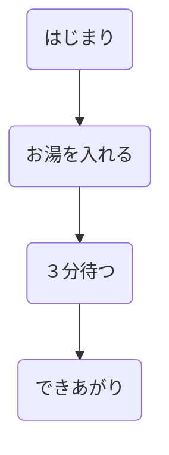
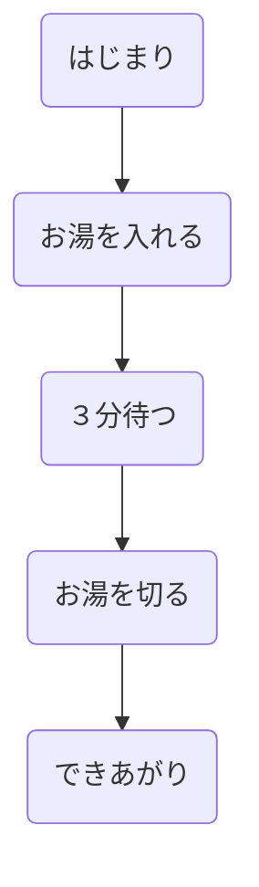
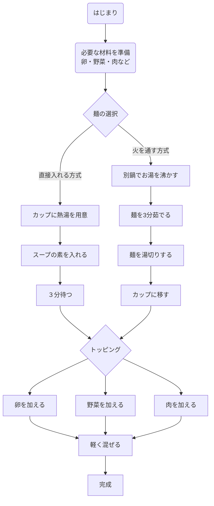
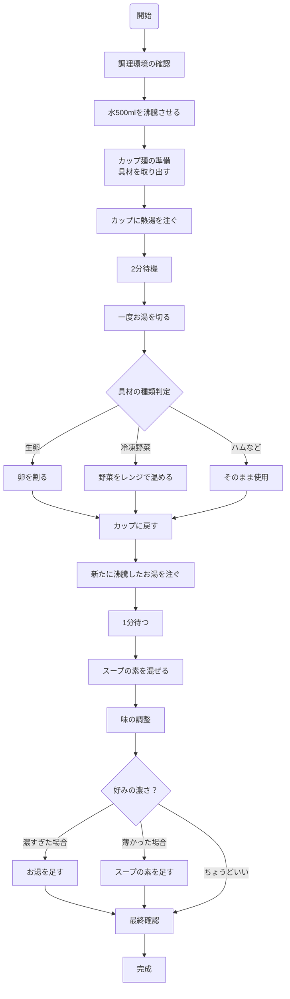
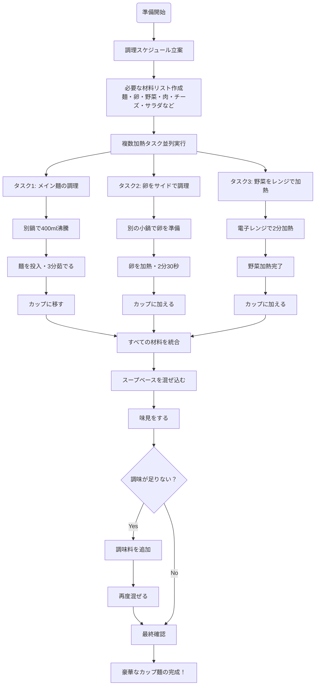

# シンプルなカップ麺の作り方

```mermaid
flowchart TB
start(はじまり) --> addHotWater
addHotWater(お湯を入れる) --> wait
wait(３分待つ) --> finish(できあがり)
```

```mermaid
flowchart TB
start(はじまり) --> addHotWater
addHotWater(お湯を入れる) --> wait
wait(３分待つ) --> drainWater(お湯を切る)
drainWater --> finish(できあがり)
```

# より複雑なカップ麺の作り方

## 豪華版 - トッピング付き調理方法

```mermaid
flowchart TB
start(はじまり) --> prepMaterials
prepMaterials(必要な材料を準備<br/>卵・野菜・肉など) --> selectMethod
selectMethod{麺の選択}
selectMethod -->|火を通す方式| boilWater[別鍋でお湯を沸かす]
selectMethod -->|直接入れる方式| cupHotWater[カップに熱湯を用意]
boilWater --> cookNoodles[麺を3分茹でる]
cookNoodles --> drainNoodles[麺を湯切りする]
drainNoodles --> transferCup[カップに移す]
cupHotWater --> addSoup[スープの素を入れる]
addSoup --> waitCook[３分待つ]
waitCook --> selectTopping{トッピング}
transferCup --> selectTopping
selectTopping --> addEgg[卵を加える]
selectTopping --> addVeg[野菜を加える]
selectTopping --> addMeat[肉を加える]
addEgg --> mix[軽く混ぜる]
addVeg --> mix
addMeat --> mix
mix --> finish[完成]
```

## 高度版 - 2段階加熱調理

```mermaid
flowchart TB
start(開始) --> checkEnv[調理環境の確認]
checkEnv --> boilWater[水500mlを沸騰させる]
boilWater --> prepCup[カップ麺の準備<br/>具材を取り出す]
prepCup --> firstPour[カップに熱湯を注ぐ]
firstPour --> wait1[2分待機]
wait1 --> firstDrain[一度お湯を切る]
firstDrain --> judgeIng{具材の種類判定}
judgeIng -->|生卵| crackEgg[卵を割る]
judgeIng -->|冷凍野菜| heatVeg[野菜をレンジで温める]
judgeIng -->|ハムなど| keepHam[そのまま使用]
crackEgg --> returnCup[カップに戻す]
heatVeg --> returnCup
keepHam --> returnCup
returnCup --> secondPour[新たに沸騰したお湯を注ぐ]
secondPour --> wait2[1分待つ]
wait2 --> mixSoup[スープの素を混ぜる]
mixSoup --> adjustTaste[味の調整]
adjustTaste --> checkTaste{好みの濃さ？}
checkTaste -->|濃すぎた場合| addWater[お湯を足す]
checkTaste -->|薄かった場合| addSoup[スープの素を足す]
addWater --> finalCheck[最終確認]
addSoup --> finalCheck
checkTaste -->|ちょうどいい| finalCheck
finalCheck --> finish[完成]
```

## エクストリーム版 - 複数具材同時調理

```mermaid
flowchart TB
start(準備開始) --> planSchedule[調理スケジュール立案]
planSchedule --> listMaterials[必要な材料リスト作成<br/>麺・卵・野菜・肉・チーズ・サラダなど]
listMaterials --> parallelStart[複数加熱タスク並列実行]
parallelStart --> task1[タスク1: メイン麺の調理]
parallelStart --> task2[タスク2: 卵をサイドで調理]
parallelStart --> task3[タスク3: 野菜をレンジで加熱]
task1 --> boilNoodles[別鍋で400ml沸騰]
task2 --> prepEgg[別の小鍋で卵を準備]
task3 --> heatVeg[電子レンジで2分加熱]
boilNoodles --> cookNoodles[麺を投入・3分茹でる]
prepEgg --> cookEgg[卵を加熱・2分30秒]
heatVeg --> finishVeg[野菜加熱完了]
cookNoodles --> transferCup[カップに移す]
cookEgg --> addEgg[カップに加える]
finishVeg --> addVeg[カップに加える]
transferCup --> combine[すべての材料を統合]
addEgg --> combine
addVeg --> combine
combine --> mixSoup[スープベースを混ぜ込む]
mixSoup --> taste[味見をする]
taste --> checkTaste{調味が足りない？}
checkTaste -->|Yes| addSeason[調味料を追加]
addSeason --> remixAll[再度混ぜる]
remixAll --> finalCheck[最終確認]
checkTaste -->|No| finalCheck
finalCheck --> finish[豪華なカップ麺の完成！]
```
